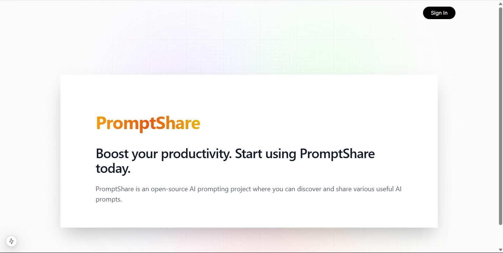
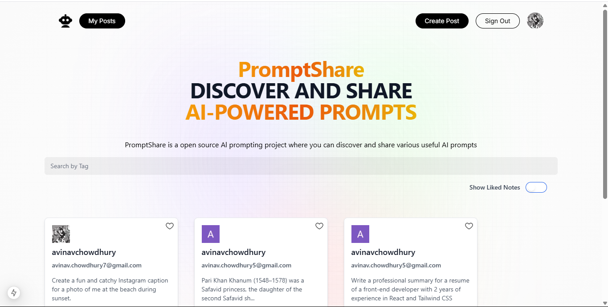
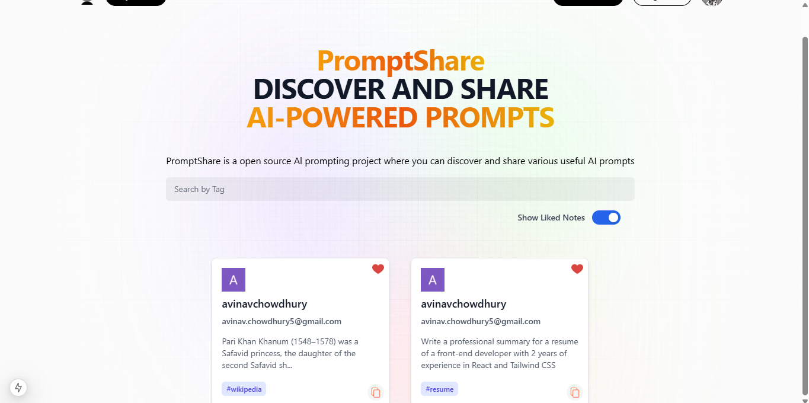
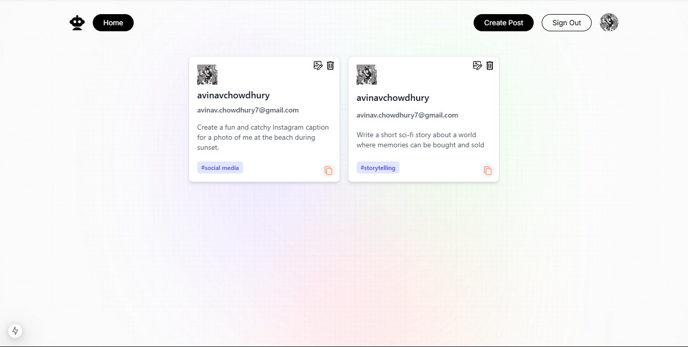

# 🚀 PromptShare

PromptShare is a modern full-stack web application where users can **sign in with Google**, **share AI prompts**, **like prompts**, and **view personal contributions**. It's built using **Next.js** and **MongoDB**, with full CRUD capabilities for prompt management.

---

## 🌐 Live Demo

🔗 Try it here: [https://promptshare.vercel.app](https://prompt-share-neon.vercel.app/)

---

## 📸 Screenshots

### 🔐 Login Page


### 🏠 Home Page


### ❤️ Liked Posts


### ✍️ Your Posts


> 📝 Save these images inside the `images/` folder in your root directory (as shown in your repo structure).

---

## 🛠️ Features

- 🔐 Google Sign-In Authentication
- 📝 Create, Read, Update, and Delete (CRUD) prompts
- 🧠 Explore useful AI prompts from other users
- ❤️ Like or unlike prompts
- 👤 View and manage your own posts
- 💻 Responsive design for mobile and desktop

---

## 🧑‍💻 Tech Stack

- **Frontend**: React (via Next.js `app` directory)
- **Backend**: Next.js API routes
- **Database**: MongoDB (with Mongoose models)
- **Authentication**: NextAuth.js + Google OAuth
- **Styling**: Tailwind CSS
- **Hosting**: Vercel

---


## 📁 Folder Structure

```
promptshare/
├── app/                 # App directory (Next.js 13+)
├── components/          # Reusable UI components
├── images/              # Screenshot assets for README
├── models/              # Mongoose models for MongoDB
├── public/assets/       # Static assets like icons/images
├── styles/              # Global styles (e.g., Tailwind CSS)
├── utils/               # Helper functions/utilities
├── .gitignore
├── README.md
├── jsconfig.json
├── next.config.js
├── package.json
├── package-lock.json
├── postcss.config.mjs
└── tailwind.config.mjs
```

---

## ⚙️ Getting Started Locally

1. **Clone the repository**
```bash
git clone https://github.com/your-username/promptshare.git
cd promptshare
```

2. **Install dependencies**
```bash
npm install
```

3. **Set up environment variables**

Create a `.env.local` file in the root directory and add the following:

```env
MONGODB_URI=your_mongodb_connection_string
GOOGLE_CLIENT_ID=your_google_client_id
GOOGLE_CLIENT_SECRET=your_google_client_secret
NEXTAUTH_URL=http://localhost:3000
NEXTAUTH_SECRET=your_random_secret
```

4. **Run the development server**
```bash
npm run dev
```

> Visit [http://localhost:3000](http://localhost:3000) in your browser to see the app in action.
